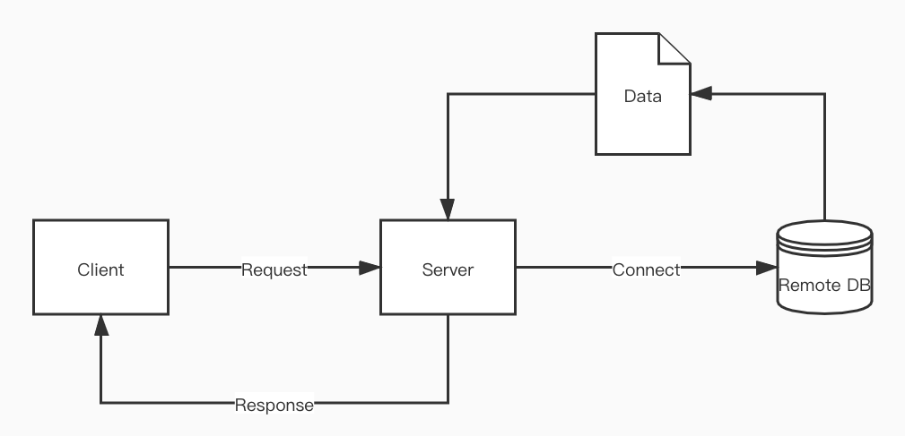
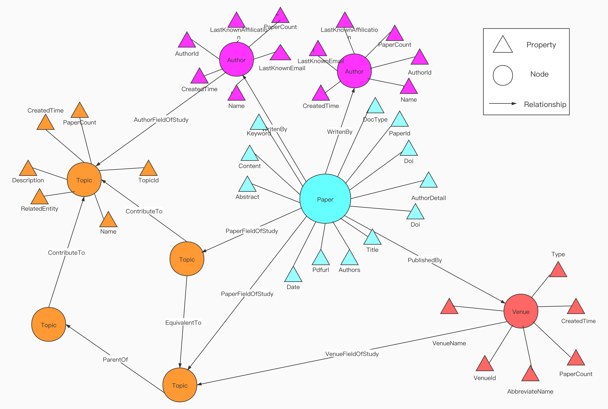

# Academic Knowledge Graph System Design

>Author: Lingze Zeng
>
>Email: Zenglz_pro@163.com
>
>Version: v1.0


[TOC]

## Architecture 




**Client**

使用Vue.js在浏览器端给用户提供服务

**Server**

使用Java Sprint boot搭建快速原型，接受Client请求，根据请求，在远程数据库中查找数据，并对数据进行业务逻辑的处理。返回Client

**Remote DataBase**

远程数据库选用Neo4j

> **Note:**
>
> 现阶段采用静态的数据，数据库里的数据都经过脚本预处理


## Function Description

### 面向用户功能

**检索作者（Search Author）**

输入检索关键字，模糊匹配作者姓名，根据匹配情况，获取所有匹配成功作者的词条，根据相应的排序规则，页面展示作者词条的视图。点击某个词条可进入作者主页。

**检索论文（Search Paper）**

输入检索关键字，模糊匹配论文题目，摘要，刊号，时间，获取所有匹配成功论文的词条，根据相应的排序规则，页面展示论文词条的视图。点击某个词条可进入论文主页。

**检索会议和期刊（Search Venue）**

输入检索关键字，模糊匹配会议或期刊的名字，简称，获取所有匹配成功期刊和会议，根据相应的排序规则，页面展示会议词条的视图。点击某个词条可进入会议或期刊的主页。

**检索主题（Search Topic）**

输入检索关键字，模糊匹配主题或领域的名字，相关领域，描述，获取所有匹配成功的主题的词条，根据相应的排序规则，页面展示主题词条的视图。点击某个词条可进入主题主页。

**综合检索（Combined Search）**

输入关键字，完成上述四种功能的任务，页面分区展示搜索结果，点击某个词条主页。

****

**获取作者主页 （Get Page Of Author）**

进入作者主页，展示如下信息：

- 作者ID编号
- 作者名称
- 作者最新所属的组织（根据论文PDF的解析结果获得）
- 作者最新所用的邮箱 (根据论文PDF的解析结果获得)
- 作者发表过的论文列表(按时间顺序)
- 作者所研究的领域（Topic）
- 作者曾在那些期刊或会议上发表过论文（Venue）
- Co-authors 列表


**获取论文主页（Get Page Of Paper）**

进入论文主页，展示如下信息：

- 论文ID编号

- 论文题目（Title）

- 论文作者列表

- 论文所属会议或者期刊

- 论文数字编号（Doi）

- 论文PDF下载路径

- 论文摘要

- 论文正文内容（分块进行展示）

- 论文引用列表

- 论文引用的情感倾向

- 论文的分类（Main Subject）

- 论文的主题（Topic）

  

**获取期刊和会议主页（Get Page Of Venue）**

进入会议或者期刊主页，展示如下信息：

- 期刊或者会议的论文数
- 期刊或者会议的名字
- 期刊或者会议的简称
- 期刊或者会议下的论文列表


**获取主题的主页（Get Page Of Topic）**

进入主题主页，展示如下信息：

- 主题名称
- 主题在Wiki中相关Entity
- 主题在Wiki中的描述（Description）
- 主题的相关主题，上级主题，下级主题
- 主题的论文列表（根据Similarity Score进行排序）


## DataBase Design

Academic Graph 采用Neo4j 图数据库进行储存,静态数据用RDF格式进行储存，附带静态数据路径。

数据库服务器 ```http://47.98.184.87:7474/```

### Graph DataBase Concept Diagram



### Node

---

**#Author**

**Schema**

Static Path: ```static/akg/Node/Authors.rdf​```

| #Column | Name                 | Type   | Note        |
| :-----: | -------------------- | ------ | ----------- |
|    1    | AuthorId             | string | PRIMARY KEY |
|    2    | Name                 | string |             |
|    3    | PaperCount           | long   |             |
|    4    | LastKnowAffilication | string |             |
| 6 | LastKnowEmail | string |             |
| 7 | CreatedTime | string |             |
|         |                      |        |             |

**#Paper**

**Schema**

Static Path: ```static/akg/Node/Papers.rdf​```

| \#Column | Name           | Type   | Note                   |
| :-----: | -------------- | ------ | ---------------------- |
|    1    | PaperId        | string | PRIMARY KEY            |
|    2    | Doi            | string |                        |
|    3    | Title          | string |                        |
|4| Authors |string|Serilized List Of Author Name|
|5| AuthorDetail |string|Serilized List|
|    4    | DocType        | uint   | 1:Conference 2:Journal |
|    5    | Date           | string |                        |
|    6    | ReferenceCount | uint   |                        |
|    7    | CitationCount  | uint   |                        |
|			8		|Pdfurl	|	string|		|
|    9    | Abstract       | string |                        |
|  10   | Main Subject     | string  |                        |
| 11|Related Subjects|string|Serilized List|
|12| Content |string|Serilized Dict|
|13|Reference|string|Serilized List|
|14| Reference Context|string|Serilized Dict|
|15| Keywords|string|Serilized List|
|16| CreatedTime|string||

> **Note:**
>
> 因Neo4j property里无法储存除string，uint，float外的数据类型，因此其他类型经过序列化处理成string进行储存。
>
> Author Detail 是从论文PDF中解析到的作者的具体信息，List类型
>
> ```python
> [
> AuthorInformationDict_1,
> AuthorInformationDict_2,
> AuthorInformationDict_3
> ]
> ```
> 其中AuthorInformationDict，为Dict类型,其中Affiliation还套接了一个Dict类型
> 
> ```json
> {
> 'Name':'Tang Wang',
> 'email':'qdasdasdas@qq.com',
> 'affiliation':{
> 'department': 'Computer Science Dept',
> 'institution': 'Tsinghua University',
> 'address': {'country': 'China'}}
> }
> ```
> 
> 
> 
>Content 是论文PDF解析的全文,Dict类型
> 
>```json
> {
>"1 headtexta":"context1",
> "2 headtextb":"context2",
> "headtextc":"context3",
> "n headtextx":"context5"
> }
> ```
> 
> Reference 是论文PDF解析的引用信息，List类型
> 
>```json
> [
>{
> "id":"Example_ID_1",
> "analytic":{'authors':['S.D.Paul','Kobe.B','Lebron.J'],'title':"NBA basketball game"},
> "monogr":{'title':'sksks','authors':['Somuns.M','F.Y','Chalice.L']},
> "note":"Dota2 is the best computer game in the world"
> }
> ,
> {
> "id":"Example_ID_2",
> "analytic":{'authors':['S.D.Paul','Kobe.B','Lebron.J'],'title':"NBA basketball game"},
> "monogr":{'title':'sksks','authors':['Somuns.M','F.Y','Chalice.L']},
> "note":"Dota2 is the best computer game in the world"
> }
> ]
> ```
> 
> Reference Context 是论文PDF解析出引用在全文中对应的句子，Dict类型
> 
>```json
> {
>"ReferenceID_1":[ "Sentence1", "Sentence2","Sentence3"],
> "ReferenceID_2":["Sentence3","Sentence4"]
> }
> ```


**#Venue**

**Schema**

Static Path: ```static/akg/Node/Venues.rdf​```

| \#Column |      Name       |  Type  |          Note          |
| :------: | :-------------: | :----: | :--------------------: |
|    1     |     VenueId     | string |      PRIMARY KEY       |
|    2     |    VenueName    | string |                        |
|    3     | AbbreviatedName | string |                        |
|    4     |   PaperCount    |  uint  |                        |
|    5     |   CreatedTime   | string |                        |
|    6     |      Type       |  uint  | 1:Conference 2:Journal |
|    7     |    YearList     | string |     Serilized List     |
|          |                 |        |                        |
|          |                 |        |                        |


**#Topic**

**Schema**

Static Path: ```static/akg/Node/Topics.rdf​```

| \#Column |     Name      |  Type  |    Note     |
| :------: | :-----------: | :----: | :---------: |
|    1     |    TopicId    | string | PRIMARY KEY |
|    2     |     Name      | string |             |
|    3     | RelatedEntity | string |             |
|    4     |  Description  | string |             |
|    5     |  CreatedTime  | string |             |
|    6     |  PaperCount   |  uint  |             |
|    7     |  AuthorCount  |  uint  |             |
|    8     |  VenueCount   |  uint  |             |


### Relationship

---

这里用关系型数据库的表示形式来表示图数据库中的边即关系

**#WritenBy**

**Schema**

Static Path: ```static/akg/Relation/WritenBy.rdf​```

| \#Columns | Name         | Type   | Note                   |
| --------- | ------------ | ------ | ---------------------- |
| 1         | PaperId      | string | FOREIGN KEY REFERENCES |
| 2         | AuthorId     | string | FOREIGN KEY REFERENCES |
| 3         | AuthorDetail | string | Serilized List         |


**#PublishedBy**

**Schema**

Static Path: ```static/akg/Relation/PublishedBy.rdf​```

| \#Columns | Name    | Type   | Note                   |
| --------- | ------- | ------ | ---------------------- |
| 1         | PaperId | string | FOREIGN KEY REFERENCES |
| 2         | VenueId | string | FOREIGN KEY REFERENCES |
| 3         | Date    | string |                        |


**#PaperFieldOfStudy**

**Schema**

Static Path: ```static/akg/Relation/PaperFieldOfStudy.rdf​```

| \#Columns | Name    | Type   | Note                   |
| --------- | ------- | ------ | ---------------------- |
| 1         | PaperId | string | FOREIGN KEY REFERENCES |
| 2         | TopicId | string | FOREIGN KEY REFERENCES |
| 3         | Score   | float  | Pearson similarity     |

**#AuthorFieldOfStudy**

**Schema**

Static Path: ```static/akg/Relation/AuthorFieldOfStudy.rdf​```

| \#Columns |   Name   |  Type  |          Note          |
| :-------: | :------: | :----: | :--------------------: |
|     1     | AuthorId | string | FOREIGN KEY REFERENCES |
|     2     | TopicId  | string | FOREIGN KEY REFERENCES |
|     3     |  Score   | float  |   Pearson similarity   |

**#VenueFieldOfStudy**

**Schema**

Static Path: ```static/akg/Relation/VenueFieldOfStudy.rdf​```

| \#Columns |  Name   |  Type  |          Note          |
| :-------: | :-----: | :----: | :--------------------: |
|     1     | VenueId | string | FOREIGN KEY REFERENCES |
|     2     | TopicId | string | FOREIGN KEY REFERENCES |
|     3     |  Score  | float  |   Pearson similarity   |


**#ParentOf**

**Schema**

Static Path: ```static/akg/Relation/ParentOf.rdf​```

| \#Columns | Name          | Type   | Note                             |
| --------- | ------------- | ------ | -------------------------------- |
| 1         | ParentTopicId | string | FOREIGN KEY REFERENCES (TopicId) |
| 2         | ChildTopicId  | string | FOREIGN KEY REFERENCES (TopicId) |
|           |               |        |                                  |

**#ContributeTo**

**Schema**

Static Path: ```static/akg/Relation/ContributeTo.rdf​```

| \#Columns | Name      | Type   | Note                             |
| --------- | --------- | ------ | -------------------------------- |
| 1         | TopicId_1 | string | FOREIGN KEY REFERENCES (TopicId) |
| 2         | TopicId_2 | string | FOREIGN KEY REFERENCES (TopicId) |
|           |           |        |                                  |

**#EquivalentTo**

**Schema**

Static Path: ```static/akg/Relation/EquivalentTo.rdf​```

| \#Columns | Name      | Type   | Note                             |
| --------- | --------- | ------ | -------------------------------- |
| 1         | TopicId_1 | string | FOREIGN KEY REFERENCES (TopicId) |
| 2         | TopicId_2 | string | FOREIGN KEY REFERENCES (TopicId) |
|           |           |        |                                  |


### Index

---

在原节点上建立Index,便于高效率的搜索。

**#Paprer**

| #Columns |   Name   |    Note     |
| :------: | :------: | :---------: |
|    1     | PaperId  | PRIMARY KEY |
|    2     |  Title   |    Index    |
|    3     | Abstract |    Index    |
|    4     |   Doi    |    Index    |
|    5     |   Date   |    Index    |
|          |          |             |

**#Venue**

| #Columns |      Name       |    Note     |
| :------: | :-------------: | :---------: |
|    1     |     VenueId     | PRIMARY KEY |
|    2     |    VenueName    |    Index    |
|    3     | AbbreviatedName |    Index    |


**#Author**

| #Columns |   Name   |    Note     |
| :------: | :------: | :---------: |
|    1     | AuthorId | PRIMARY KEY |
|    2     |   Name   |    Index    |
|          |          |             |


**#Topic**

| \#Column |  Name   |    Note     |
| :------: | :-----: | :---------: |
|    1     | TopicId | PRIMARY KEY |
|    2     |  Name   |    Index    |


## API Design

### Client-Server API Document

>Note:
>
> 后端代码编写过程中，建议使用swagger或类似的API 自动生成插件。便于同步更新最新API 文档
>
>在测试API接口中，建议使用PostMan进行API 接口的测试，同时同步更新PostMan上的API 文档

**服务器API地址**

前缀：
```http://{}```（补充）


完整的API地址为：```前缀```+```具体接口路径```

比如，获取验证码都接口为（example）：

```http://115.29.173.126:21084``` + ```/v1.0/open/smscode```

->

```http://115.29.173.126:21084/v1.0/open/smscode```

**调用接口说明**

- 如果参数格式是JSON的话：提交request请求时必须添加header头：```Content-Type:application/json```
- 请求中是否要包含头信息：```Authorization:{accesstoken} ```(权限设计功能，可能之后版本迭代中会需要)
    - 接口中包含```/open/```的：不需要添加
    - 接口中不包含```/open/```：需要添加
        - 说明该接口都需要对应的权限才可以访问，所以需要在请求中包含头信息：```Authorization:{accesstoken}```
    - 当access token无效或者已过期时，返回：
```json
{
  "code": 401,
  "message": "invalid access token: wrong or expired"
}
```

- 所有的接口的返回形式都是统一为：

    正常返回
```json
{
  "code": 200,
  "message": "OK",
  "data": "某种类型的数据，比如字符串，数字，字典等等"
}
```
 	   错误返回

```json
{
  "code": 具体的错误码,
  "message": "具体的错误信息字符串"
}
```


**检索作者（Search Author）**

- Method:**POST**
- URL:  ```/search/author```
- Headers:```Content-Type:application/json```
- Body

	```json
{
  "token":"Author name"
}
	```

- Reponse

  ```json
  {
    "code":200,
  "message":"OK",
    "data"://Author Info ordered Array
    [
      {
        //Author Info Example
       "AuthorId":"123456",
       "Name":"Zeng lingze",
       "PaperCount":12,
       "email":"Zenglz_pro@163.com",
       "afflication":"Beijing Institute of technology"
      },
      {
        "AuthorId":"1234",
        "Name":"Jia lingze",
        "PaperCount":12,
        "email":"Zenglz_pro@163.com",
       	"afflication":"Beijing Institute of technology"
      }
    ]
  }
  ```
  


**检索论文（Search Paper）**

- Method:**POST**

- URL:  ```/search/paper```

- Headers:```Content-Type:application/json```

- Body

  ```json
  {
  "token":"Paper info"
  }
  ```

- Reponse

  ```json
  {
    "code":200,
    "message":"OK",
    "data"://Paper Info ordered Array
    [
      {
        //Paper Info Example
       "PaperId":"123456",
       "title":"Knowledge graph",
       "Author":["Zenglz","kky","miracle"],
       "Abstract":"123",
       "Keywords":["Knowledge Graph","Data Mining"],
        "PDF":"url"
      },
      {
       "PaperId":"123456",
       "title":"Knowledge graph 2",
       "Author":["Zenglz","kky","miracle"],
       "Abstract":"123456",
       "Keywords":["Machine Learning","Data Mining"],
        "PDF":"url"
      }
    ]
  }
  ```


**检索会议或期刊（Search Venue）**

- Method:**POST**

- URL:  ```/search/venue```

- Headers:```Content-Type:application/json```

- Body

  ```json
  {
  "token":"info"
  }
  ```

- Reponse

  ```json
  {
    "code":200,
    "message":"OK",
    "data"://Venue Info ordered Array
    [
      {
        //Venue Info Example
       "VenueId":"123456",
       "Name":"Computer Vision and Pattern Recognition ",
       "AbbreviateName":"CVPR",
       "Topic":["Knowledge Graph","Data Mining"]
      },
      {
       "VenueId":"456",
       "Name":"IEEE International Conference on Computer Vision",
       "AbbreviateName":"ICCV",
       "Topic":["Pattern Recognition","Computer Vision"]
      }
    ]
  }
  ```


**检索主题（Search Topic）**

- Method:**POST**

- URL:  ```/search/topic```

- Headers:```Content-Type:application/json```

- Body

  ```json
  {
  "token":"info"
  }
  ```

- Reponse

  ```json
  {
    "code":200,
    "message":"OK",
    "data"://Topic Info ordered Array
    [
      {
        //Venue Info Example
       "TopicId":"123456",
       "Name":"Computer Vision",
       "Description":"cnajsk"
      },
      {
        "TopicId":"12345678",
       "Name":"Knowlegde graph",
       "Description":"cnajskccy"
      }
    ]
  }
  ```


**综合检索（Combined Search）**

- Method:**POST**

- URL:  ```/search/combined```

- Headers:```Content-Type:application/json```

- Body

  ```json
  {
  "token":"info"
  }
  ```

- Reponse

  ```json
  {
    "code":200,
    "message":"OK",
    "data"://"Dict"
   {
     "Topic":[TopicOneInfojson,TopicTwoInfojson],
     "Author":[AuthorOneInfojson,AuthorTwoInfojson],
     "Paper":[PaperOneInfojson,PaperTwoInfojson],
     "Venue":[VenueOneInfojson,VenueTwoInfojson]
   }
  }
  ```


**获得作者主页（Get Page of Author）**

- Method:**GET**

- URL:  ```/static/author/{authorid}```

- Headers:```Content-Type:application/json```

- Body

  ```json
  {
    
  }
  ```

- Reponse

  ```json
  {
    "code":200,
    "message":"OK",
    "data"://"Dict"
   {
     "Authorid":"123456",
     "Name":"Zenglingze",
     "Topic":{ "TopicId":"TopicName"},
     "Papers":[PaperOneInfo,PaperTwoInfo], //ordered in time series
     "email":"Zenglz_pro@163.com",
     "afflication":"Beijing",
     "Venue":{"VenueId":"VenueName"},
     "Coauthor":{"AuthorId":"AuthorName"},
     "PaperCount":7
   }
  }
  ```


**获得论文主页（Get Page of Paper）**

- Method:**GET**

- URL:  ```/static/paper/{paperid}```

- Headers:```Content-Type:application/json```

- Body

  ```json
  {
    
  }
  ```

- Reponse

  ```json
  {
    "code":200,
    "message":"OK",
    "data"://"Dict"
   {
     "Paperid":"123456",
     "Title":"AAA",
     "Abastract":"BBB",
     "Topic":{ "TopicId":"TopicName"},
     "Venue":{"VenueId":"VenueName"},
     "author":{"AuthorId":"AuthorName"},
     "subject":["SubjectOne","SubjectTwo"],
     "content":{contentInfo},//详细格式见上数据库设计
     "reference":[ReferenceInfo],//详细格式见上数据库设计
   	 "referenceEmotion":[],//详细格式见上数据库设计
     "PDF":"url",
     "Doi":"Doi"
   }
  }
  ```


**获得会议或期刊主页（Get Page of Venue）**

- Method:**GET**

- URL:  ```/static/Venue/{venueid}```

- Headers:```Content-Type:application/json```

- Body

  ```json
  {
    
  }
  ```

- Reponse

  ```json
  {
    "code":200,
    "message":"OK",
    "data"://"Dict"
   {
     "Venueid":"123456",
     "Topic":{ "TopicId":"TopicName"},
     "Papers":[PaperOneInfojson,PaperTwoInfojson],
     "Name":"",
     "AbbreviateName":"ICCV",
     "PaperCount":12
   }
  }
  ```


**获得主题主页（Get Page of Topic）**

- Method:**GET**

- URL:  ```/static/Topic/{topicid}```

- Headers:```Content-Type:application/json```

- Body

  ```json
  {
    
  }
  ```

- Reponse

  ```json
  {
    "code":200,
    "message":"OK",
    "data"://"Dict"
   {
     "Topicid":"123456",
     "Name":"Computer vision",
     "EquivalentTo":{"Topicid":"TopicName"},
     "Parent":{"Topicid":"TopicName"},
     "Child":{"Topicid":"TopicName"},
     "ContributeTo":{"Topicid":"TopicName"},
     "EntityInWiki":"Computer_vision",
  	 "Description":"AAA",
     "VenueCount":7,
     "PaperCount":12,
   }
  }
  ```


## Data Structure


## Problems

